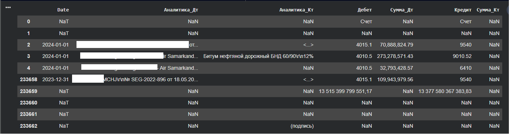
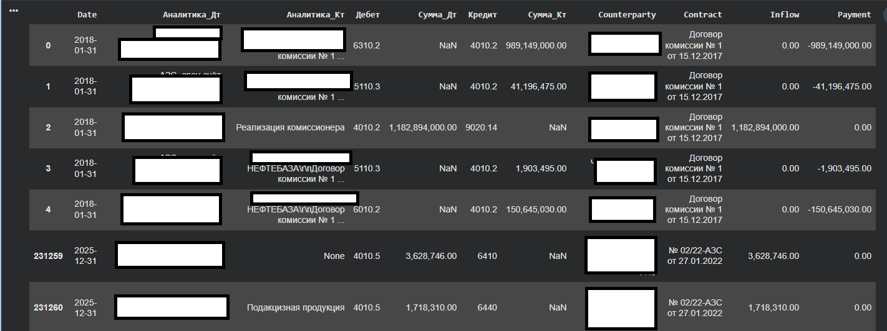
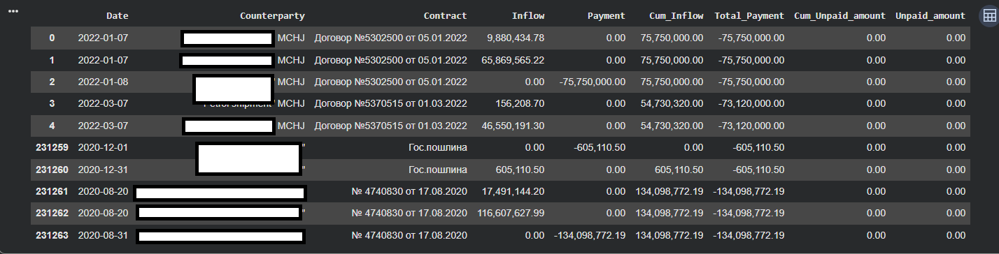
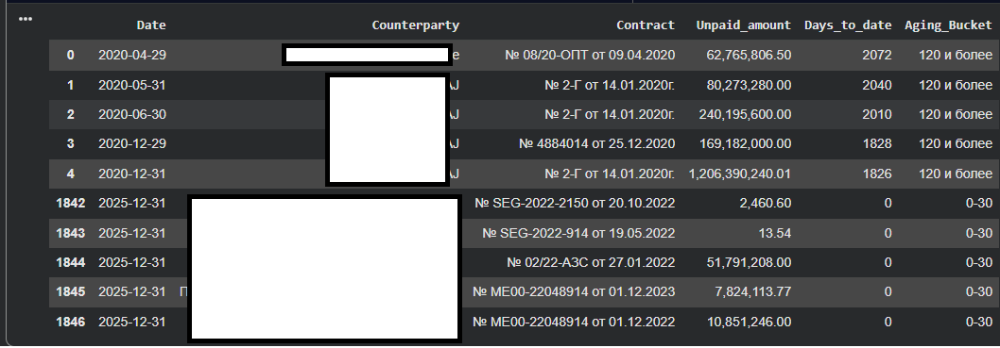
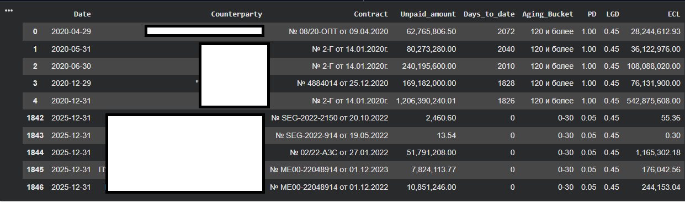

# IFRS 9 Expected Credit Loss (ECL) Automation

This project demonstrates the automation of **Expected Credit Loss (ECL)** calculations in accordance with **IFRS 9** requirements using **Python (Pandas)** and **DuckDB SQL**.

The solution implements a complete **ETL pipeline** for loading, cleansing and transforming financial data, followed by automated calculation of **Probability of Default (PD)**, **Loss Given Default (LGD)** and **Exposure at Default (EAD)** parameters, and generation of the final analytical dataset for financial reporting.

> **Note:** All source data, entity names and file paths have been anonymized or modified for public publication.

---

## Key Features

- Loading and consolidation of credit portfolio data;
- Data cleansing and transformation;
- ETL processing using **Python (Pandas)** and **DuckDB SQL**;
- Using calculated **PD (Probability of Default)**;
- Usnig calculated **LGD (Loss Given Default)**;
- Automated calculation of **EAD (Exposure at Default)**;
- Automated **IFRS 9 Expected Credit Loss (ECL)** calculation;
- Generation of the final analytical reporting dataset;
- Export of processed results to Excel.

---

## Technology Stack

**Python • Pandas • NumPy • DuckDB SQL • IFRS 9 • ETL • Financial Data Analysis • Excel**

---

## Source Code

The complete implementation of the ETL pipeline and IFRS 9 ECL calculation logic is available in the Jupyter Notebook:

📓 [Open Jupyter Notebook](./IFRS_9_ECL_automatization_ipynb.ipynb)

---

## Business Use Case

The project is based on a real-world financial reporting automation scenario.

It demonstrates the processing of large financial datasets, automation of IFRS 9 Expected Credit Loss calculations, preparation of risk parameters (**PD, LGD, EAD**), and generation of analytical outputs for further use in financial reporting and BI systems.

The implemented approach significantly reduces manual data processing while improving consistency, transparency and auditability of financial calculations.

---

## Data Processing Workflow

### 1. Loading and Preparation of Source Data

### 2. Data Cleansing and Transformation

### 3. Calculation of Unpaid Exposure Amounts

### 4. Aging Bucket Analysis

### 5. IFRS 9 Expected Credit Loss (ECL) Calculation

---

## Skills Demonstrated

- Financial Data Analysis
- ETL Pipeline Development
- Python (Pandas, NumPy)
- DuckDB SQL
- IFRS 9 Expected Credit Loss (ECL)
- PD / LGD / EAD Modeling
- Data Cleansing and Transformation
- Financial Reporting Automation
- Analytical Dataset Preparation
- Excel Reporting Automation

---

## Disclaimer

This repository is intended solely to demonstrate technical skills in **financial data processing**, **ETL development**, and **financial reporting automation**.

All source data, file paths, entity names and business-sensitive information have been anonymized or modified for public release. The project does not contain confidential or proprietary company information.
